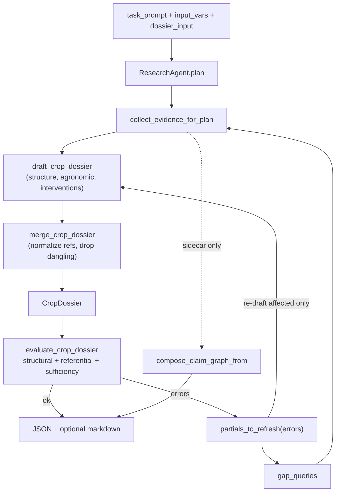

## What changed vs the previous draft of this plan

Incorporated reviewer feedback:

1. `run_claim_graph` is **demoted to legacy internal convenience**. The CLI never calls it for sidecar; new code uses `compose_claim_graph_from`. Docstring + PUBLIC_API note make this explicit so the "claim graph as primary artifact" mental model doesn't persist.
2. Evidence IDs from `evidence_items_to_refs` are **run-local only**. `EvidenceItem.id` is position-based (`E001`, `E002`, ...) assigned in [src/research_agent/retrieval/scoring.py:27-31](src/research_agent/retrieval/scoring.py). Dossiers are portable within a run; cross-run identity requires content-hash evidence IDs (out of scope, documented as follow-up).
3. `CropDossierDraft` is the **near-final nested shape**, not a flattened transport DTO. It equals `CropDossier` minus `{meta, last_updated, evidence_index}`. Less bridge code, no field-name drift, renderer/validator work on the same shape the LLM produces.
4. `evaluate_crop_dossier` has **three explicit layers**: structural (contract + thresholds), referential (dangling evidence IDs + merge-time dropped refs), and sufficiency (per-section evidence-linkage minimums). Prevents the loop converging on structurally valid but useless dossiers.
5. `merge_crop_dossier` performs **reference normalization at merge time**: drops `InterventionEffect` entries whose `intervention_id` / `target_ref` don't resolve, drops out-of-vocabulary `affected_stages` / `cover_crop_effects.target_ref` values, returns the dropped list so the evaluator can surface them as errors. Doesn't rely only on prompt discipline + late validation.
6. `DossierInputVars` lives in **`contracts/agronomy/input.py`**, not `types.py`. Keeps `InputVars` (retrieval context) and `DossierInputVars` (artifact seed) visibly separate.
7. **Offline dossier demo asymmetry acknowledged**: `--demo --dossier` still requires a live OpenAI key today, while `claim-graph --demo --validate-only` runs offline. Documented as known asymmetry; follow-up is a canonical offline dossier JSON + a `--validate-only` or similar path. Not in scope here.
8. **Gap-iteration policy: rerun only affected partials**, not all three. Error codes map to partials; first iteration runs all three, subsequent iterations only re-draft the partials whose validator codes are still failing. Bounded cost and clearer convergence.
9. **Uniform output shape across primary modes**: `{plan, evidence, <artifact>, validation_errors, iterations}` + optional `claim_graph_sidecar`. `run()` is updated to emit `validation_errors: []` on success so the schema is consistent regardless of mode.

## Behavior change to flag up front

Today `research-agent --claim-graph` replaces the FinalReport with a ClaimGraphBundle (primary mode). Under the new rule `--claim-graph` becomes a pure sidecar that composes with whichever primary mode is active. The valid matrix:

- `(nothing)` or `--final-report` → FinalReport
- `--claim-graph` → FinalReport + ClaimGraphBundle sidecar (**was** ClaimGraphBundle alone)
- `--dossier` → CropDossier
- `--dossier --claim-graph` → CropDossier + ClaimGraphBundle sidecar
- `--final-report --dossier` → argparse error (mutex group)

Small backward-compat break for anyone running `--claim-graph` alone; they now also get a FinalReport in the output JSON. Accepted per the user's stated rule. `run_claim_graph()` stays as a Python entry point for compatibility but is marked legacy in PUBLIC_API.

## Data flow



## Schemas (extend [src/research_agent/agent/schemas.py](src/research_agent/agent/schemas.py))

Three partials carry exactly the fields the corresponding LLM call fills. `CropDossierDraft` is a near-final nested shape.

```python
class DossierStructurePartial(BaseModel):
    model_config = ConfigDict(extra="forbid")
    crop_name: str
    crop_category: CropCategory
    primary_use_cases: list[str]
    priority_tier: PriorityTier
    production_system_context: ProductionSystemContext
    rotation_role: RotationRole
    lifecycle_ontology: list[LifecycleStage]

class DossierAgronomicPartial(BaseModel):
    model_config = ConfigDict(extra="forbid")
    yield_drivers: list[YieldDriver]
    limiting_factors: list[LimitingFactor]
    agronomist_heuristics: list[HeuristicRule]

class DossierInterventionPartial(BaseModel):
    model_config = ConfigDict(extra="forbid")
    interventions: list[Intervention]
    intervention_effects: list[InterventionEffect]
    pathogens: list[Pathogen]
    beneficials: list[BeneficialOrganism]
    soil_dependencies: list[SoilDependency]
    microbiome_roles: list[MicrobiomeFunction]
    cover_crop_effects: list[CoverCropEffect]
    confidence: float
    open_questions: list[str]

class CropDossierDraft(BaseModel):
    """Near-final nested shape. CropDossier minus {meta, last_updated, evidence_index}."""
    model_config = ConfigDict(extra="forbid")
    # ...all fields from CropDossier except meta / last_updated / evidence_index
    # Constructed by spreading the three partials; field names already match CropDossier.
```

`CropDossierDraft` is reconstructable trivially from the three partials — no flattening transform, just set-union of their fields.

## Input contract (new [src/research_agent/contracts/agronomy/input.py](src/research_agent/contracts/agronomy/input.py))

```python
from pydantic import BaseModel, Field
from research_agent.contracts.agronomy.dossier import CropCategory, PriorityTier

class DossierInputVars(BaseModel):
    """Artifact-seed context for CropDossier generation. Distinct from research InputVars."""
    crop_name: str
    crop_category: CropCategory
    primary_use_cases: list[str] = Field(default_factory=list)
    priority_tier: PriorityTier = "T2"
    use_case: str | None = None
```

`InputVars` (retrieval context) remains in [src/research_agent/types.py](src/research_agent/types.py). The two are imported from different modules so the distinction stays visible to readers.

## Bridge + merge (new [src/research_agent/agent/dossier_bridge.py](src/research_agent/agent/dossier_bridge.py))

Evidence mapping + merge-time normalization with explicit dropped-refs accounting.

```python
@dataclass
class DroppedRef:
    kind: str                # "intervention_effect" | "cover_crop_effect" | "affected_stage" | ...
    location: str            # "intervention_effects[2]" | "pathogens[0].affected_stages[1]"
    value: str               # the offending id/name
    reason: str              # "unknown_intervention_id" | "unknown_target_ref" | "not_a_lifecycle_stage"

def evidence_items_to_refs(items: list[EvidenceItem]) -> list[EvidenceRef]:
    """Map retrieval EvidenceItems to contract EvidenceRefs using run-local ids."""

def _normalize_references(
    draft: CropDossierDraft,
) -> tuple[CropDossierDraft, list[DroppedRef]]:
    """
    Drop InterventionEffect entries with unknown intervention_id / target_ref,
    drop Pathogen.affected_stages values not in LifecycleStageName literal,
    drop CoverCropEffect.target_ref values not resolving, etc.
    Returns (cleaned_draft, dropped) so the evaluator can surface drops as errors.
    """

def merge_crop_dossier(
    draft: CropDossierDraft,
    evidence_refs: list[EvidenceRef],
    *,
    artifact_id: str,
    now: datetime,
) -> tuple[CropDossier, list[DroppedRef]]:
    cleaned, dropped = _normalize_references(draft)
    dossier = CropDossier(
        meta=ArtifactMeta(
            artifact_id=artifact_id,
            artifact_type="crop_dossier",
            created_at=now, updated_at=now,
            tags=["agronomy"],
        ),
        last_updated=now.date(),
        evidence_index=evidence_refs,
        **cleaned.model_dump(),
    )
    return dossier, dropped
```

**Evidence identity note (documented in README + PUBLIC_API):** `evidence_ids` in a dossier are **run-local**. They match the order of evidence items produced by `dedupe_evidence`. A dossier serialized from run A will not cross-reference a `ClaimGraphBundle` from run B. Content-hash-derived IDs are a future enhancement; for now, treat `evidence_index` as an embedded snapshot of the evidence, not a reference to a global corpus.

## ResearchAgent methods (extend [src/research_agent/agent/research.py](src/research_agent/agent/research.py))

```python
Partial = Literal["structure", "agronomic", "interventions"]

def draft_crop_dossier(
    self,
    task_prompt: str,
    input_vars: dict,
    dossier_input: DossierInputVars,
    evidence: list[EvidenceItem],
    *,
    refresh_only: set[Partial] | None = None,
    prior: CropDossierDraft | None = None,
) -> CropDossierDraft:
    """
    First iteration: refresh_only = None -> run all three partial calls.
    Subsequent iterations: refresh_only = {"agronomic"} (say) -> only re-draft that partial;
    merge with prior's other partials. Later partial calls still receive prior
    partials' content in their user_payload so FKs stay anchored.
    """

def evaluate_crop_dossier(
    self,
    dossier: CropDossier,
    evidence: list[EvidenceItem],
    dropped_refs: list[DroppedRef],
    thresholds: DossierThresholds | None = None,
) -> tuple[bool, list[str]]:
    """
    Layer A (structural): validate_crop_dossier_detailed(dossier, thresholds).
    Layer B (referential):
      - evidence_id_unknown:{id} for every evidence_ids value not in {e.id for e in evidence}
      - merge_ref_dropped:{kind}:{value} for every DroppedRef from merge
    Layer C (sufficiency):
      - per-section_evidence_floor:{section} when <thresholds.min_evidence_linked_per_section[section]>
        of the items in that section carry at least one evidence_id
    Returns (ok, error_strings) where each string is "{code}: {message}".
    """

def run_dossier(
    self,
    task_prompt: str,
    input_vars: InputVars,
    dossier_input: DossierInputVars,
    *,
    thresholds: DossierThresholds | None = None,
) -> dict:
    # plan (reuse generic self.plan with CropDossierDraft.model_json_schema())
    # evidence = collect_evidence_for_plan(plan, input_vars)
    # draft = self.draft_crop_dossier(...)
    # for iteration in range(self.max_iterations):
    #   dossier, dropped = merge_crop_dossier(draft, evidence_items_to_refs(evidence), ...)
    #   ok, errors = self.evaluate_crop_dossier(dossier, evidence, dropped, thresholds)
    #   if ok: return uniform shape
    #   gap = self.gap_queries(..., missing_requirements=errors, ...)
    #   if new queries: evidence += collect_incremental_evidence(gap)
    #   refresh = _partials_to_refresh(errors)
    #   draft = self.draft_crop_dossier(..., refresh_only=refresh, prior=draft)
    # return best-effort dossier with non-empty validation_errors
```

### Error-code → partial mapping (`_partials_to_refresh`)

```python
_CODE_TO_PARTIAL: dict[str, Partial] = {
    # structural
    "lifecycle_missing_stages":            "structure",
    # agronomic
    "too_few_yield_drivers":               "agronomic",
    "too_few_limiting_factors":            "agronomic",
    # intervention/biotic
    "too_few_interventions":               "interventions",
    "too_few_pathogens":                   "interventions",
    "intervention_effect_dangling_fk":     "interventions",
    "merge_ref_dropped":                   "interventions",
    # sufficiency errors include a :section suffix
    "per_section_evidence_floor:yield_drivers":   "agronomic",
    "per_section_evidence_floor:interventions":   "interventions",
    "per_section_evidence_floor:pathogens":       "interventions",
}
# low_evidence_coverage and evidence_id_unknown do not map to a single partial;
# they trigger a retrieval gap-fill only (no LLM re-draft) since more evidence
# is what's missing. If they persist after retrieval, every partial gets refreshed.
```

### Thresholds extended

```python
class DossierThresholds(BaseModel):
    min_yield_drivers: int = 3
    min_interventions: int = 3
    min_pathogens: int = 2
    min_evidence_linked_fraction: float = 0.5   # global
    min_evidence_linked_per_section: dict[str, int] = Field(
        default_factory=lambda: {"yield_drivers": 1, "interventions": 1, "pathogens": 1}
    )
```

`validate_crop_dossier_detailed` extended to emit `per_section_evidence_floor:{section}` codes when a section has fewer evidence-linked items than its floor.

## Claim-graph sidecar

Extract a pure helper, and keep `run_claim_graph` for backwards compatibility:

```python
def compose_claim_graph_from(
    self,
    task_prompt: str,
    input_vars: dict,
    plan: PlanOut,
    evidence: list[EvidenceItem],
) -> dict[str, Any]:
    """Draft + evaluate + merge claim-graph from a pre-collected plan + evidence."""

def run_claim_graph(self, task_prompt, input_vars):
    """LEGACY: retained for existing Python callers. New code should use
    run(...) / run_dossier(...) and, if also wanting a claim-graph sidecar,
    call compose_claim_graph_from(plan, evidence) with the primary run's plan
    + evidence. Not wired into the CLI anymore."""
```

[docs/PUBLIC_API.md](docs/PUBLIC_API.md) carries a "legacy" annotation on `run_claim_graph`. CLI never calls it.

## Output shape (uniform across modes)

```python
# default / --final-report
{ "plan": {...}, "evidence": [...], "final": {...},
  "validation_errors": [], "iterations": 1 }

# --dossier
{ "plan": {...}, "evidence": [...], "dossier": {...},
  "validation_errors": [], "iterations": 1 }

# + --claim-graph sidecar (combines with either primary)
{ ..., "claim_graph_sidecar": {
    "claim_graph": {...}, "validation_errors": [] }
}
```

`ResearchAgent.run(...)` is updated to emit `validation_errors: []` on success for parity.

## CLI ([src/research_agent/cli/research.py](src/research_agent/cli/research.py))

```python
primary = parser.add_mutually_exclusive_group()
primary.add_argument("--final-report", action="store_true")
primary.add_argument("--dossier", action="store_true")
parser.add_argument("--claim-graph", action="store_true",
                    help="Also emit a ClaimGraphBundle sidecar from the same plan + evidence")
parser.add_argument("--render-markdown", type=str,
                    help="Write rendered dossier markdown to this path (--dossier only)")
```

Task-file format (strictly additive):

```json
{
  "task_prompt": "...",
  "input_vars": { "topic": "...", "company": "...", "region": "..." },
  "dossier_input": {
    "crop_name": "Wheat",
    "crop_category": "cereal",
    "primary_use_cases": ["pathogen panel"],
    "priority_tier": "T1"
  }
}
```

`dossier_input` is required when `--dossier` is set AND `--demo` is not. Demo payload includes a default `DossierInputVars` keyed to wheat.

Main loop (abridged):

```python
primary_out = (
    agent.run_dossier(task_prompt, input_vars, dossier_input)
    if args.dossier
    else agent.run(task_prompt, input_vars)
)

if args.claim_graph:
    primary_out["claim_graph_sidecar"] = agent.compose_claim_graph_from(
        task_prompt, input_vars,
        plan=PlanOut.model_validate(primary_out["plan"]),
        evidence=[EvidenceItem.model_validate(e) for e in primary_out["evidence"]],
    )

if args.dossier and args.render_markdown:
    md = render_crop_dossier_markdown(CropDossier.model_validate(primary_out["dossier"]))
    Path(args.render_markdown).write_text(md, encoding="utf-8")

print(json.dumps(primary_out, indent=2, ensure_ascii=False))
```

## Tests (offline)

- `tests/test_dossier_bridge.py`
  - `evidence_items_to_refs` preserves `id`, `url`, `source_type`, and round-trips through `EvidenceRef`.
  - `_normalize_references` drops a forged `InterventionEffect` with unknown `intervention_id`, a forged `target_ref`, an out-of-vocab `affected_stages` value; asserts each `DroppedRef` has the expected `kind` + `location` + `reason`.
  - `merge_crop_dossier` returns `(CropDossier, dropped)` and the dossier has `meta`, `last_updated`, and a fully-populated `evidence_index`.
- `tests/test_evaluate_crop_dossier.py`
  - Layer A: demo dossier → ok; empty dossier → structural errors.
  - Layer B: inject an `evidence_ids=["E_BOGUS"]` → `evidence_id_unknown:E_BOGUS`; inject a `DroppedRef` → `merge_ref_dropped:...`.
  - Layer C: strip evidence from all `yield_drivers` → `per_section_evidence_floor:yield_drivers`.
- `tests/test_partials_to_refresh.py`
  - `too_few_yield_drivers` → `{"agronomic"}`.
  - `intervention_effect_dangling_fk` → `{"interventions"}`.
  - `lifecycle_missing_stages` → `{"structure"}`.
  - `evidence_id_unknown:*` alone → `set()` (retrieval-only gap, no re-draft).
- `tests/test_dossier_cli_args.py`
  - `--final-report --dossier` → SystemExit 2.
  - `--claim-graph` alone → parses, primary stays FinalReport.
  - `--dossier` without `dossier_input` in task file → `parser.error`.
  - `--dossier --claim-graph` parses cleanly.

Live LLM tests remain out of scope; no `tests/live/` directory is added in Phase 1b.

## Docs

- [README.md](README.md): valid-matrix table for `--final-report` / `--dossier` / `--claim-graph`; "Generating a live dossier" section with a task-file snippet; short "Evidence IDs are run-local" caveat.
- [docs/PUBLIC_API.md](docs/PUBLIC_API.md): add `CropDossierDraft`, `DossierStructurePartial`, `DossierAgronomicPartial`, `DossierInterventionPartial`, `DossierInputVars`, `DroppedRef`, `evidence_items_to_refs`, `merge_crop_dossier`, `ResearchAgent.run_dossier`, `ResearchAgent.compose_claim_graph_from`. Annotate `run_claim_graph` as legacy (still supported, not recommended for new code). Note `--claim-graph` CLI semantics change.
- [docs/ARCHITECTURE.md](docs/ARCHITECTURE.md): "Dossier mode" subsection with the mermaid diagram, the error-code → partial mapping, and a one-paragraph iteration-cost policy (first iteration: 3 partial calls + 1 plan; subsequent: 1-2 partial calls + optional gap retrieval).

## Risks and watchouts

- **OpenAI strict-schema surface area.** Three partial schemas are bounded. Riskiest fields: `Pathogen.affected_stages: list[LifecycleStageName]` and `LimitingFactor.stage: LifecycleStageName | None`. Existing `_patch_json_schema_for_openai_strict` in [src/research_agent/agent/llm.py](src/research_agent/agent/llm.py) should handle it; no new patching code anticipated. First live run of each partial is the test.
- **Gap-fill vs thresholds.** Default evidence-coverage threshold (0.5 global, 1 per-section) may cause `run_dossier` to converge slowly. `run_dossier(thresholds=...)` kwarg lets callers relax during early dev; CLI uses `DossierThresholds()`.
- **Token cost.** First iteration: 1 plan + 3 partials + retrieval. Worst case with 3 iterations of selective refresh: 1 plan + up to 3 partials on iter 1 + up to 2 partials/iter × 2 iters + 1-2 gap calls = ~6-9 LLM calls. Documented in README.
- **Sidecar execution_id.** ClaimGraphBundle sidecar gets its own `ExecutionContext` (`exec-sidecar-{run_tag}`) but the same evidence as the primary dossier run.
- **Demo asymmetry.** `--demo --dossier` requires a live OpenAI key (consistent with today's `--demo --claim-graph` for the retrieval path). `claim-graph --demo --validate-only` runs offline via `build_agrinova_demo_bundle`; dossier mode has no offline equivalent yet. Documented as a known asymmetry; follow-up is a canonical offline dossier JSON + a dossier-side `--validate-only` path.
- **Run-local evidence IDs.** A dossier's `evidence_ids` only cross-resolve within the same run's `evidence_index`. Not stable across runs. Future work: content-hash-derived `EvidenceItem.id` in `retrieval/scoring.py`.
- **Retrieval-only gaps.** `evidence_id_unknown` and `low_evidence_coverage` trigger gap retrieval but NOT a re-draft on their own (avoid redrafting with the same context). If they persist after retrieval, every partial gets refreshed as a fallback.

## Deferred (still out of scope)

- Questionnaire applicability filtering engine (Phase 2).
- Prioritization artifact (Phase 3).
- Synthesis / ontology extraction (Phase 4).
- Single-call LLM fallback / auto-escalation (if multi-call proves reliable, a later simplification can add it behind a flag).
- Content-hash-derived evidence identity for cross-run dossier comparison / merge.
- Offline `--demo --dossier --validate-only` path (canonical JSON artifact + render from disk).
- Dossier renderer enhancements beyond the current markdown template.
