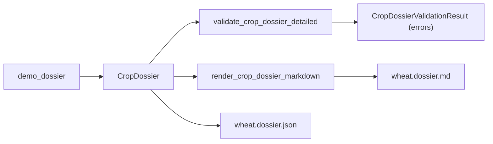

## Critique of the incoming spec

Before implementing, the proposal needs a few corrections so it composes cleanly with the current codebase:

1. **Don't drop the richness that already exists.** The current `CropDossier` has `lifecycle_ontology` (with `key_decisions` / `observables` / `failure_modes`), `production_system_context`, `rotation_role`, `crop_category`, `priority_tier`, and `meta: ArtifactMeta`. The spec's flatter replacement (`lifecycle_stages`, `production_systems: list[str]`) loses evidence-linked sub-structure. Go **additive**: keep existing fields, add the new ones.
2. **Reuse `Claim` and `EvidenceRef`; do not invent a third evidence type.** The repo already has `research_agent.contracts.core.claims.Claim` (narrative + `evidence_ids: list[str]`) and `research_agent.contracts.core.evidence.EvidenceRef`. The spec's `EvidenceRef` should map to the existing one, and new entities (`YieldDriver`, `LimitingFactor`, `Pathogen`, `Intervention`, etc.) should each carry an `evidence_ids: list[str]` pointing at the dossier's `evidence_index` (same pattern already used by `Claim`). That lands the "≥50% claims evidence-linked" acceptance criterion cheaply.
3. **Keep structured fields structured, add rationale as Claim.** `YieldDriver.mechanism: str` is weak for future querying; propose `mechanism: Claim` so the explanation itself is evidence-anchored, while `name` / `measurable_proxies` stay plain strings. Same pattern for `LimitingFactor.symptoms: list[Claim]`, `HeuristicRule.rationale: Claim`.
4. **Link interventions to their targets by ID, not free-form strings.** `InterventionEffect.intervention: str` + `target: str` is brittle. Give `Intervention` a stable `id`; let `InterventionEffect.intervention_id` / `target_ref` reference driver/pathogen/soil IDs. This is what makes the dossier queryable in Phase 4.
5. **Validation goes through a detailed validator mirroring `validate_claim_graph_detailed`** — return `CropDossierValidationResult` with `ok: bool` + `errors: list[ValidationIssue]` (errors-only for now, matching the recently-simplified claim-graph result). Do **not** use ad-hoc asserts or put thresholds inside Pydantic validators; keep them pluggable.
6. **`priority_score` is derived, not stored.** If Phase 3 later computes it, make it a `@computed_field` or a `compute_priority_score(candidate)` helper. Don't carry an always-stored field that can silently drift from the weights.
7. **Scope discipline.** The original spec also says "Update research prompts: force extraction into these fields." The repo currently has no LLM-driven dossier-generation pipeline (only `ResearchAgent` for the claim graph / final report). Phase 1 therefore stops at schema + validator + renderer + demo + docs. Prompt / agent integration is a Phase 1b follow-up once the schema is stable.
8. **Acceptance thresholds are sensible but should be configurable.** Hard-coding "≥3 yield drivers, ≥3 interventions, ≥2 pathogens, ≥50% claims evidence-linked" in the validator is fine, but expose them via a `DossierThresholds` dataclass with defaults so downstream users can tune.

## Target schema (additive, goes in [src/research_agent/contracts/agronomy/dossier.py](src/research_agent/contracts/agronomy/dossier.py))

All new fields default to empty so existing artifacts keep validating.

```python
class YieldDriver(BaseModel):
    id: str
    name: str
    mechanism: Claim                          # evidence-linked explanation
    measurable_proxies: list[str] = []
    evidence_ids: list[str] = []

class LimitingFactor(BaseModel):
    id: str
    factor: str
    stage: LifecycleStageName | None = None
    symptoms: list[Claim] = []
    evidence_ids: list[str] = []

class HeuristicRule(BaseModel):
    id: str
    condition: str                            # free-form for now; grammar later
    action: str
    rationale: Claim
    evidence_ids: list[str] = []

class Intervention(BaseModel):
    id: str
    kind: Literal["input", "management", "genetic"]
    name: str
    evidence_ids: list[str] = []

class InterventionEffect(BaseModel):
    intervention_id: str                      # FK -> Intervention.id
    target_ref: str                           # FK -> YieldDriver.id | Pathogen.id | SoilDependency.id
    effect: Literal["increase", "decrease", "conditional"]
    rationale: Claim | None = None
    evidence_ids: list[str] = []

class Pathogen(BaseModel):
    id: str
    name: str
    pressure_conditions: list[str] = []
    affected_stages: list[LifecycleStageName] = []
    evidence_ids: list[str] = []

class BeneficialOrganism(BaseModel):
    id: str
    name: str
    function: str
    evidence_ids: list[str] = []

class SoilDependency(BaseModel):
    id: str
    variable: str                             # pH, texture, SOM
    role: Claim
    evidence_ids: list[str] = []

class MicrobiomeFunction(BaseModel):
    id: str
    function: str                             # N fixation, pathogen suppression
    importance: Claim
    evidence_ids: list[str] = []

class CoverCropEffect(BaseModel):
    cover_crop: str
    target_ref: str                           # YieldDriver / SoilDependency id
    effect: Claim
    evidence_ids: list[str] = []
```

Extend `CropDossier` additively (keep every existing field unchanged):

```python
class CropDossier(BaseModel):
    # Keep: meta, crop_name, crop_category, primary_use_cases, priority_tier,
    #       last_updated, production_system_context, rotation_role, lifecycle_ontology

    # NEW - D. Agronomic model
    yield_drivers: list[YieldDriver] = []
    limiting_factors: list[LimitingFactor] = []
    agronomist_heuristics: list[HeuristicRule] = []

    # NEW - E. Intervention layer
    interventions: list[Intervention] = []
    intervention_effects: list[InterventionEffect] = []

    # NEW - F. Biotic risks
    pathogens: list[Pathogen] = []
    beneficials: list[BeneficialOrganism] = []

    # NEW - G. Soil / microbiome relevance
    soil_dependencies: list[SoilDependency] = []
    microbiome_roles: list[MicrobiomeFunction] = []

    # NEW - H. System interactions (rotation already has rotation_role)
    cover_crop_effects: list[CoverCropEffect] = []

    # NEW - I. Evidence & meta (re-using existing EvidenceRef)
    evidence_index: list[EvidenceRef] = []
    confidence: float = 0.0
    open_questions: list[str] = []
```

Drop the spec's proposed `production_systems: list[str]` and `lifecycle_stages: list[LifecycleStage]` / `cultivar_segments` — the existing `production_system_context` and `lifecycle_ontology` cover them with better structure. `cultivar_segments` is out of scope for Phase 1 (no call sites; add later if needed).

## Validator (new file: [src/research_agent/contracts/agronomy/validation.py](src/research_agent/contracts/agronomy/validation.py))

Mirror the pattern in [src/research_agent/contracts/core/claim_graph.py](src/research_agent/contracts/core/claim_graph.py) (`validate_claim_graph_detailed`).

```python
class DossierThresholds(BaseModel):
    min_yield_drivers: int = 3
    min_interventions: int = 3
    min_pathogens: int = 2
    min_evidence_linked_fraction: float = 0.5

class CropDossierValidationResult(BaseModel):
    ok: bool
    errors: list[ValidationIssue]            # reuse existing ValidationIssue

def validate_crop_dossier_detailed(
    dossier: CropDossier,
    thresholds: DossierThresholds = DossierThresholds(),
) -> CropDossierValidationResult: ...

def validate_crop_dossier(dossier: CropDossier) -> list[str]:
    """Human-readable messages only; see validate_crop_dossier_detailed for codes."""
```

Checks (all emit `ValidationIssue(level="error", code=..., message=...)`):
- `lifecycle_missing_stages` (already covered by `validate_required_stages`; wrap it)
- `too_few_yield_drivers`, `too_few_interventions`, `too_few_pathogens`
- `intervention_effect_dangling_fk` (unknown `intervention_id` / `target_ref`)
- `evidence_id_dangling` (any `evidence_ids` not in `evidence_index`)
- `low_evidence_coverage` (fraction of claim-bearing items with ≥1 evidence_id below threshold)

## Renderer (extend [src/research_agent/contracts/renderers/markdown.py](src/research_agent/contracts/renderers/markdown.py))

Keep the existing `render_crop_dossier_markdown` output and append new sections **only when the corresponding list is non-empty**, so legacy demos stay stable:

- `### Yield Drivers` - table: Name | Mechanism | Proxies | Evidence
- `### Limiting Factors` - table keyed by Stage
- `### Agronomist Heuristics` - list of "If condition then action (rationale [evidence])"
- `### Interventions` and `### Intervention Effects` (FK-resolved to human-readable names)
- `### Biotic Risks` - pathogens + beneficials
- `### Soil & Microbiome` - soil_dependencies + microbiome_roles
- `### Cover Crop Effects`
- `### Open Questions` and `### Confidence`

## Demo artifacts ([examples/build_demo_artifacts.py](examples/build_demo_artifacts.py))

Extend `demo_dossier()` with: 3 yield drivers (e.g. canopy N status, water availability, Fusarium risk), 3 interventions (seed treatment, N split, resistant cultivar), 2 pathogens (Fusarium, Septoria), ≥1 soil dependency (pH), ≥1 microbiome function (suppression), ≥1 heuristic, a populated `evidence_index`, and `intervention_effects` linking drivers. This both exercises the renderer and validates cleanly against `DossierThresholds()`.

Regenerate `examples/generated/wheat.dossier.{md,json}` as part of the PR diff.

## Tests (new file: `tests/test_crop_dossier_validation.py`)

- Empty dossier → errors for too_few_* and missing stages.
- Demo dossier → `ok=True`, zero errors.
- Dangling FK (`intervention_effects[0].target_ref = "ZZZ"`) → specific code.
- Low evidence coverage → `low_evidence_coverage` error; raising threshold to 0.9 triggers it while 0.1 clears it.
- `validate_crop_dossier(dossier)` returns the same messages as `validate_crop_dossier_detailed(...).errors`.

## Data-flow recap



## Docs

- [docs/PUBLIC_API.md](docs/PUBLIC_API.md): add the new classes and `validate_crop_dossier` / `validate_crop_dossier_detailed` to the stable surface.
- [docs/ARCHITECTURE.md](docs/ARCHITECTURE.md): one-paragraph update to the `contracts/agronomy` section noting the new agronomic-model layer.
- [docs/REFACTORING.md](docs/REFACTORING.md): a "no breaking change" note — old dossiers keep validating; new fields default to empty.

## Deferred (explicitly out of scope for this PR)

- Phase 1b: LLM-driven dossier generation inside `ResearchAgent` (new task / prompt stack). Requires its own plan.
- Phase 2: questionnaire applicability filtering engine. The current `QuestionSpec.applicability_rules: list[str]` + `required_context: list[str]` is already wired to the dossier; a structured `ApplicabilityRule` type and a `satisfies()` engine will land in a separate plan, reusing the field names dossier now exposes (e.g. `microbiome_roles`, `yield_drivers`).
- Phase 3: `CropUseCaseCandidate` / `TierList` + scoring CLI.
- Phase 4: cross-crop synthesis and `PlatformPrimitive` extraction.