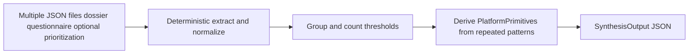

# Next two steps: retrieval hardening, then Phase 4 synthesis

## Context (current repo)

- **Phase 2–3 artifacts** (dossier, questionnaire, prioritization) and CLIs are in place; [docs/TIER1_PIPELINE.md](docs/TIER1_PIPELINE.md) documents recipe-style orchestration.
- **Retrieval leak:** [`src/research_agent/retrieval/__init__.py`](src/research_agent/retrieval/__init__.py) imports [`sources`](src/research_agent/retrieval/sources.py), which imports `feedparser` and `BeautifulSoup` at module import time. So `import research_agent.retrieval` (package root) pulls **retrieval extras** even though [`scoring.py`](src/research_agent/retrieval/scoring.py) is dependency-light (only `research_agent.types`). Most call sites import submodules (`retrieval.cache`, `retrieval.sources`) directly; the package `__init__` is the main unnecessary choke point.
- **Smoke coverage already exists:** [`tests/test_cli_dossier_questionnaire_merge.py`](tests/test_cli_dossier_questionnaire_merge.py) (dossier + questionnaire merge), [`tests/test_prioritization.py`](tests/test_prioritization.py) (`research-agent-prioritize` with mocks). Step 1 can **verify** these satisfy the spec and only add tests if a gap appears (e.g. explicit `import research_agent.retrieval` without failing without `[retrieval]`).

---

## Step 1 — Short hardening pass (cleanup, not a feature phase)

### 1.1 Fix optional-dependency leakage

- **Change [`retrieval/__init__.py`](src/research_agent/retrieval/__init__.py)** so it does **not** import [`sources`](src/research_agent/retrieval/sources.py) at load time.
  - **Preferred:** Re-export only **`scoring`** symbols (`assign_evidence_ids`, `dedupe_evidence`, `score_evidence`) that are safe on a core install, and document that `tavily_search`, `retrieve_scholarly_*`, `collect_evidence_for_plan`, etc. are imported from **`research_agent.retrieval.sources`** (unchanged).
  - **Alternative:** Lazy `__getattr__` for the current `sources` exports (same pattern as [`agent/__init__.py`](src/research_agent/agent/__init__.py)), preserving backward compatibility for `from research_agent.retrieval import tavily_search` if any external code relies on it.
- **Regression test:** In a **fresh subprocess** (like [`tests/test_import_hygiene.py`](tests/test_import_hygiene.py)), assert `import research_agent.retrieval` does not load `feedparser` (check `sys.modules`), when run **without** retrieval extras installed—or document that CI always uses `[dev]` and the test skips if `feedparser` is present.
- **Scope note:** [`retrieval/http.py`](src/research_agent/retrieval/http.py) imports `requests` (retrieval extra). Submodules like `sources` will still require extras when **imported**; the goal is to stop **accidental** transitive imports via the empty package root.

### 1.2 Tighten docs vs. reality

- Update [`docs/PUBLIC_API.md`](docs/PUBLIC_API.md) **Import ergonomics** / **Non-public modules**: state explicitly what `import research_agent.retrieval` loads **after** the fix (scoring-only vs lazy), and that `retrieval.sources` / HTTP stack still requires `[retrieval]`.
- Align [`README.md`](README.md) if it implies “core” can import the full retrieval stack without extras.

### 1.3 Smoke tests (verify / minimal add)

- **Already present:** dossier+questionnaire CLI merge; prioritization CLI (mocked). Re-read spec; add only if something is untested (e.g. package-import test above).
- No large new test matrix—keep this pass small.

---

## Step 2 — Phase 4: Cross-crop synthesis + platform primitives (narrow slice)

Stay aligned with the spec: **file-based synthesis over prior JSON**, deterministic first, **no embeddings-first**, **no** full program orchestration (Tier 1 → dossier per row remains recipe or a future thin layer).

### 2.1 Contracts ([`contracts/agronomy/`](src/research_agent/contracts/agronomy/) or [`contracts/core/`](src/research_agent/contracts/core/))

Add models (names per your spec; adjust to fit Pydantic style):

- `NormalizedConcept` — canonical string/key + source crop_id / artifact refs
- `CrossCropPattern` — grouped concepts + supporting crop refs + counts
- `OntologyNode` — lightweight node (label, kind, children optional later)
- `PlatformPrimitive` — derived primitive (kind enum: pathogen_pressure, intervention_effect, lifecycle_stage, etc.) + evidence from patterns
- `SynthesisOutput` — bundle: nodes, primitives, patterns, metadata (`synthesis_id`, `created_at`, optional `validation_warnings`)

Keep fields minimal; version the schema similarly to [`PrioritizationResult.rubric_version`](src/research_agent/contracts/agronomy/prioritization.py).

### 2.2 Extraction (pure Python, no LLM required for v1)

- Input: parsed **dicts** or validated **`CropDossier`**, **`QuestionnaireExecutionResult`** (and optionally **`PrioritizationResult`**) loaded from JSON paths.
- Extract lists for: lifecycle stages, yield drivers, limiting factors, interventions, pathogens, microbiome functions, confounders (map to dossier sections in [`agronomy/dossier.py`](src/research_agent/contracts/agronomy/dossier.py) and questionnaire responses as needed).
- **Normalization:** deterministic rules only—lower/strip, simple slug or normalized name, dedupe within artifact.

### 2.3 Grouping

- Bucket by normalized key + type; **frequency thresholds** (e.g. min crops, min mentions) as config parameters with safe defaults.
- Emit `CrossCropPattern` only when thresholds met.

### 2.4 Primitive derivation

- Map repeated patterns to a **small closed set** of primitive kinds (per spec: pathogen pressure, intervention effect, lifecycle stage, microbiome function, trial confounder, monitoring target—exact enum in code).
- **No portfolio optimization, no ontology extraction ML** in this phase.

### 2.5 CLI / recipe layer

- New entry point, e.g. **`research-agent-synthesize`** → `cli/synthesize.py` (mirrors [`cli/prioritize.py`](src/research_agent/cli/prioritize.py) simplicity):
  - Inputs: `--dossier-json` repeatable or `--inputs-manifest` JSON listing paths + types; or `--input-dir` glob by convention.
  - Output: `--output-json` full `SynthesisOutput`; optional markdown summary in [`contracts/renderers/markdown.py`](src/research_agent/contracts/renderers/markdown.py).
- Register in [`pyproject.toml`](pyproject.toml); document in PUBLIC_API and README.
- **Core vs retrieval:** synthesis should depend only on **contracts + stdlib** (and Pydantic); no need to import `retrieval.sources`.

### 2.6 Tests

- Contract round-trip JSON.
- Golden extraction: two minimal dossier JSON fixtures → expected pattern counts / primitive list.
- CLI smoke with monkeypatched file reads or temp fixtures.

### 2.7 Explicitly out of scope for Phase 4 v1

- Embeddings / semantic clustering.
- Longitudinal tracking, intervention logging, customer lifecycle (per your §6—different subsystem).
- Richer questionnaire applicability (stage-specific rules)—separate roadmap item; do not block synthesis MVP.

---

## Ordering

1. Land **Step 1** in its own PR/commit set so retrieval import behavior is stable before new `contracts` and CLI imports proliferate.
2. Implement **Step 2** as a vertical slice: contracts → extract/group → `SynthesisOutput` → CLI → tests.
