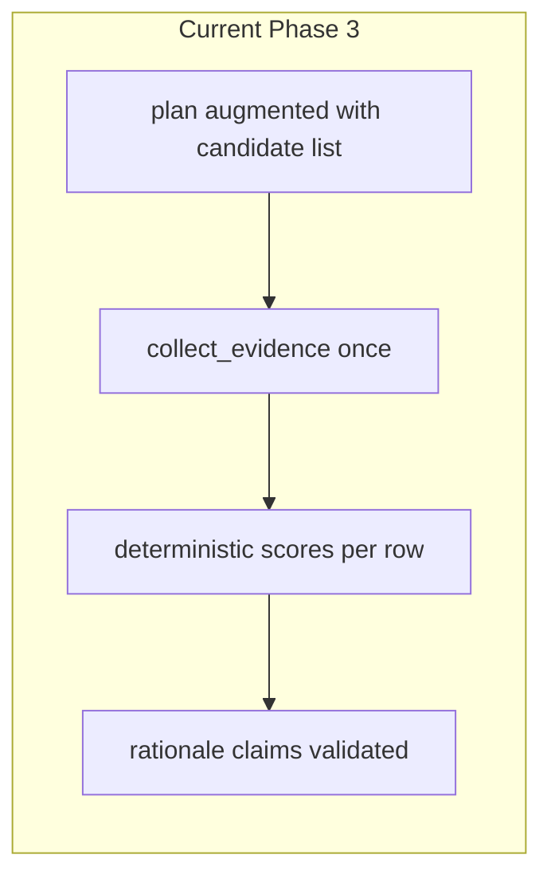

# Status vs. work description and next steps

## What the codebase already covers

### Step 0 — Hardening (largely complete)

| Intent | Where it lives |
|--------|----------------|
| Questionnaire import boundary (no eager `llm`) | [`src/research_agent/agent/questionnaire.py`](src/research_agent/agent/questionnaire.py) (`TYPE_CHECKING` + string annotations; module docstring) |
| `agent` package does not pull `research`/`llm` on questionnaire-only import | [`src/research_agent/agent/__init__.py`](src/research_agent/agent/__init__.py) (`__getattr__` lazy exports) |
| Regression test (fresh interpreter) | [`tests/test_import_hygiene.py`](tests/test_import_hygiene.py) |
| Test ergonomics: `retrieval` marker | [`pytest.ini`](pytest.ini); marked tests e.g. [`tests/test_sources_cache_integration.py`](tests/test_sources_cache_integration.py) |
| Docs: `--output-json`, stdout redaction, dossier `evidence_full`, questionnaire reuse | [`docs/PUBLIC_API.md`](docs/PUBLIC_API.md), [`docs/ARCHITECTURE.md`](docs/ARCHITECTURE.md) |
| Dossier substrate reuse (agent-level) | [`tests/test_questionnaire_research_agent.py`](tests/test_questionnaire_research_agent.py) (`test_run_questionnaire_reuses_plan_evidence_skips_new_retrieval`, `reused_retrieval_substrate`) |

**Nuance:** The original hardening note mentioned “questionnaire tests still pull retrieval eagerly.” Today, **import** hygiene is addressed; tests that **exercise** retrieval still need `[dev]` / `[retrieval]`—that is expected and documented in PUBLIC_API. No further boundary fix is required unless you want stricter separation of “contract-only” vs “integration” test packages.

**Optional gap (small):** A **CLI-level** smoke that asserts merged keys for `--dossier` + `--questionnaire-spec` (like [`tests/test_cli_output_json.py`](tests/test_cli_output_json.py)) was suggested in an earlier roadmap but is **not** present as a dedicated test—agent-level reuse is already covered. Add only if you want redundancy for CLI wiring.

---

### Step 1 — Phase 3 prioritization (complete vs. minimal target)

| Work description item | Implementation |
|----------------------|------------------|
| `CropUseCaseCandidate`, `TierList`, `PrioritizationResult` | [`src/research_agent/contracts/agronomy/prioritization.py`](src/research_agent/contracts/agronomy/prioritization.py) (+ `ScoreComponents`, `RankedCandidate`) |
| `run_prioritization` + deterministic aggregation + evidence-backed rationale | [`src/research_agent/agent/prioritization.py`](src/research_agent/agent/prioritization.py); [`ResearchAgent.run_prioritization`](src/research_agent/agent/research.py) |
| Batch CLI, JSON out, optional markdown | [`src/research_agent/cli/prioritize.py`](src/research_agent/cli/prioritize.py); entry point `research-agent-prioritize` in [`pyproject.toml`](pyproject.toml) |
| Reproducible scoring, explicit components, rationale cites evidence | Keyword/rule-based components; weighted aggregate with **validated 4-tuple weights**; [`validate_claim_evidence_ids`](src/research_agent/agent/prioritization.py) (invalid IDs + empty IDs); markdown table escaping in [`render_prioritization_markdown`](src/research_agent/contracts/renderers/markdown.py) |
| Out of scope (portfolio, ontology, clustering, expression engines, LLM-only rank) | Not implemented—aligned |

**Design choice vs. wording “lightweight evidence collection per candidate”:** The implementation uses **one** `plan` + **one** `collect_evidence` pass for the **batch** (queries cover all candidates). That matches “research-lite,” bounded retrieval, and the roadmap’s “one plan with queries covering all candidates.” Per-candidate retrieval loops would be a **future** option if recall per row is insufficient.

---

## Recommended next steps (prioritized)

### 1. Documentation parity (low effort, high clarity)

- Add **`research-agent-prioritize`** to the CLI table in [`README.md`](README.md) (README already documents `research-agent` / `claim-graph`; prioritization is only in PUBLIC_API today).
- Optionally add a one-line pointer in README: “Tier-1 crop × use-case ranking” links to PUBLIC_API for flags.

### 2. Optional hardening: CLI smoke for dossier + questionnaire merge

- Only if you want **duplicate** coverage beyond [`test_questionnaire_research_agent.py`](tests/test_questionnaire_research_agent.py): monkeypatch `ResearchAgent`, run [`cli/research.main`](src/research_agent/cli/research.py) with `--dossier` + `--questionnaire-spec` + `--questionnaire-vars`, assert `questionnaire_reused_dossier_retrieval` and merged `evidence` / `evidence_full` shape.

### 3. Product / roadmap follow-ups (post–Phase 3, not in the narrow artifact scope)

These align with your narrative (“synthesis after multiple comparable outputs”) and are **not** required to declare Phase 3 done:

- **Orchestration / glue:** A small script or doc recipe that runs `research-agent-prioritize` → takes Tier 1 candidates → runs dossier and/or questionnaire per row (batch IDs, shared cache). Lives outside or beside core CLIs.
- **Rubric and weights:** CLI or task-file fields for **weights** / `rubric_version` (currently defaults in code; weights validated but not exposed on CLI).
- **Scoring quality:** Replace or augment keyword heuristics with embeddings or rubric tables—only when you have evaluation sets.
- **Cross-crop synthesis:** Explicitly defer until you have multiple `PrioritizationResult` + dossier + questionnaire artifacts in comparable shape.

### 4. Optional contract extensions (only if needed downstream)

- **`evidence_index` or summary block** on `PrioritizationResult` (mentioned in some roadmaps)—only if consumers need a stable map from `evidence_id` → snippet without re-reading `evidence_full`.

---

## Bottom line

- **Stabilization + Phase 3 as described in your work document are already implemented** in this repo; remaining effort is **polish (README), optional tests, and orchestration/synthesis when you are ready—not a second Phase 3 build.**
- **Do not** start cross-crop synthesis as the next coding milestone unless you accept schema-only work; the next **meaningful** product step is **using** prioritization outputs to drive batch dossier/questionnaire runs, then synthesis.
