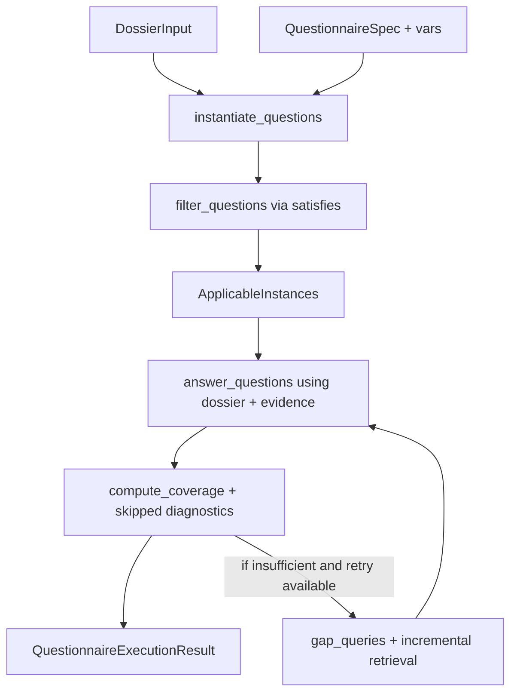

# Questionnaire Execution Layer Plan

## Choices from hints and why
- Keep `ApplicabilityRule` **generic** in core, but keep dossier-field mapping and agronomy semantics in agronomy/agent helpers. This preserves existing core-vs-agronomy layering and avoids leaking crop-specific assumptions into core contracts.
- Use **typed rules only** (no string-rule compatibility). This avoids carrying dual syntax and reduces long-term schema drift.
- Keep `answer_questions(...)` retrieval-free. Retrieval ownership remains in `ResearchAgent`, consistent with current architecture boundaries.
- Add explicit execution diagnostics and richer coverage counters so operational outcomes are observable (`not_applicable` vs `insufficient_evidence` vs `answered`).
- Require dossier as input surface: either generated in same run or loaded from file.

## Architecture changes
- Core contract additions in [`/Users/mfr/code/research-agent/src/research_agent/contracts/core/questionnaire.py`](/Users/mfr/code/research-agent/src/research_agent/contracts/core/questionnaire.py):
  - `ApplicabilityRule`
  - `SkippedQuestion` (with `question_id`, `applicable`, `skip_reason`)
  - `QuestionnaireCoverage` (`total`, `applicable`, `answered`, `insufficient_evidence`, `not_applicable`, `coverage_ratio`)
  - `QuestionnaireExecutionResult` (`responses`, `coverage`, `skipped_questions`)
  - `QuestionSpec.applicability_rules` upgraded to typed list.
- Agronomy-specific rule helpers in [`/Users/mfr/code/research-agent/src/research_agent/contracts/agronomy/questionnaire.py`](/Users/mfr/code/research-agent/src/research_agent/contracts/agronomy/questionnaire.py) and execution logic in new [`/Users/mfr/code/research-agent/src/research_agent/agent/questionnaire.py`](/Users/mfr/code/research-agent/src/research_agent/agent/questionnaire.py).

## Workflow implementation

## Concrete steps
1. **Contracts (typed, minimal, additive)**
   - Update [`/Users/mfr/code/research-agent/src/research_agent/contracts/core/questionnaire.py`](/Users/mfr/code/research-agent/src/research_agent/contracts/core/questionnaire.py) with the typed models above.
   - Keep rule operators limited to: `present`, `non_empty`, `contains_keyword`, `has_tag`.

2. **Execution helpers (pure, no retrieval)**
   - Add [`/Users/mfr/code/research-agent/src/research_agent/agent/questionnaire.py`](/Users/mfr/code/research-agent/src/research_agent/agent/questionnaire.py):
     - `instantiate_questions(spec, variables)`
     - `satisfies(dossier, rule)`
     - `filter_questions(dossier, questions)`
     - `answer_questions(instances, dossier, evidence, llm)`
     - `compute_coverage(...) -> QuestionnaireCoverage`
   - Keep helper scope narrow; no hidden calls to retrieval modules.

3. **ResearchAgent orchestration (bounded loop)**
   - Extend [`/Users/mfr/code/research-agent/src/research_agent/agent/research.py`](/Users/mfr/code/research-agent/src/research_agent/agent/research.py) with `run_questionnaire(...)`:
     - inputs: `task_prompt`, `input_vars`, `dossier`, `questionnaire_spec`, `variables`
     - retrieval orchestration happens here
     - one optional gap-fill retry max
     - explicit stop reasons: no remaining answerable questions, no meaningful new gaps, retry budget exhausted.

4. **CLI surface with explicit dossier dependency**
   - Update [`/Users/mfr/code/research-agent/src/research_agent/cli/research.py`](/Users/mfr/code/research-agent/src/research_agent/cli/research.py):
     - add questionnaire flags (`--questionnaire-spec`, `--questionnaire-vars`, `--dossier-file`)
     - require dossier either from same run (`--dossier`) or from `--dossier-file`
     - reject questionnaire mode without dossier source.

5. **Examples and renderer wiring**
   - Update [`/Users/mfr/code/research-agent/examples/questionnaire.agronomy.yaml`](/Users/mfr/code/research-agent/examples/questionnaire.agronomy.yaml) to typed applicability rules.
   - Reuse existing renderer in [`/Users/mfr/code/research-agent/src/research_agent/contracts/renderers/markdown.py`](/Users/mfr/code/research-agent/src/research_agent/contracts/renderers/markdown.py) and include skip/coverage summary section.

6. **Tests (focused, behavior-first)**
   - Add tests:
     - [`/Users/mfr/code/research-agent/tests/test_questionnaire_execution.py`](/Users/mfr/code/research-agent/tests/test_questionnaire_execution.py) for instantiation/filter/satisfies/diagnostics
     - [`/Users/mfr/code/research-agent/tests/test_questionnaire_coverage.py`](/Users/mfr/code/research-agent/tests/test_questionnaire_coverage.py)
     - [`/Users/mfr/code/research-agent/tests/test_questionnaire_cli_args.py`](/Users/mfr/code/research-agent/tests/test_questionnaire_cli_args.py)
   - Include assertions for:
     - unsupported rule operators rejected
     - distinction between `not_applicable` and `insufficient_evidence`
     - single-retry loop cap and stop reason behavior.

7. **Docs updates**
   - Update [`/Users/mfr/code/research-agent/docs/ARCHITECTURE.md`](/Users/mfr/code/research-agent/docs/ARCHITECTURE.md) and [`/Users/mfr/code/research-agent/docs/PUBLIC_API.md`](/Users/mfr/code/research-agent/docs/PUBLIC_API.md) with typed rules, dossier dependency, and execution output shape.

## Out of scope for this phase
- Expression language / arbitrary boolean rule parser.
- Standalone retrieval policy inside questionnaire helper layer.
- Multi-iteration adaptive questionnaire loop beyond one retry.