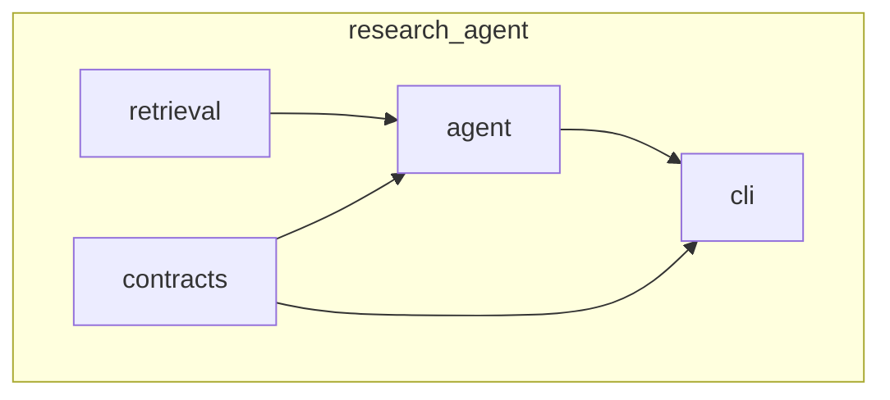

# Architecture

## Package layout

```text
src/research_agent/
  __init__.py
  __main__.py          # delegates to research CLI
  contracts/           # Pydantic contracts (core, agronomy, renderers, examples)
  retrieval/           # HTTP, DOI helpers, scoring, Tavily + scholarly sources
  agent/               # Schemas, LLM client, ResearchAgent loop, claim_graph_bridge
  cli/                 # research + claim-graph entrypoints
```




## Data flow

**FinalReport mode**

1. `ResearchAgent.plan` → `PlanOut` (LLM).
2. `collect_evidence_for_plan` → `list[EvidenceItem]` (Tavily, Crossref, OpenAlex, arXiv, page metadata).
3. `ResearchAgent.draft` → `FinalReport` JSON (LLM).
4. `ResearchAgent.evaluate` → schema + claim/evidence checks against retrieved IDs.

**Claim graph mode**

1. Same plan + evidence as above.
2. `ResearchAgent.draft_claim_graph` → `ClaimGraphDraft` (LLM).
3. `evidence_items_to_records` in `agent/claim_graph_bridge.py` maps `EvidenceItem` → `EvidenceRecord` with a synthetic `ExecutionContext` for the retrieval run.
4. `merge_claim_graph` + `validate_claim_graph` / `validate_claim_graph_detailed` in `contracts/core/claim_graph.py`.
5. Customer or debug markdown via `contracts/renderers/markdown.py` (`render_final_projection_markdown`, `style=`).

**Claim-graph CLI (`claim-graph`)**

- Loads a bundle from `--input-json` or the canonical `build_agrinova_demo_bundle()` in `research_agent.contracts.examples` (not implemented inside the CLI).

## Replacing components


| Concern                    | Module(s)                                                                |
| -------------------------- | ------------------------------------------------------------------------ |
| Retrieval backends         | `retrieval/sources.py` (add or swap functions; keep `EvidenceItem` out). |
| Scoring / dedupe           | `retrieval/scoring.py`                                                   |
| HTTP / DOI                 | `retrieval/http.py`, `retrieval/doi.py`                                  |
| LLM transport              | `agent/llm.py`                                                           |
| Report vs graph draft      | `agent/research.py` (`draft` vs `draft_claim_graph`)                     |
| Graph rules                | `contracts/core/claim_graph.py` only                                     |
| Retrieval → graph evidence | `agent/claim_graph_bridge.py`                                            |
| Markdown                   | `contracts/renderers/markdown.py`                                        |


See also [PUBLIC_API.md](PUBLIC_API.md) for what is considered stable for external use.