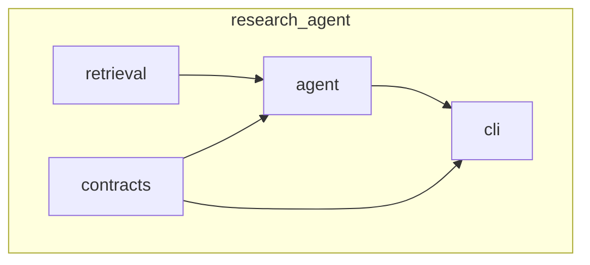

# Architecture

## Package layout

```text
src/research_agent/
  __init__.py
  __main__.py          # delegates to research CLI
  contracts/           # Pydantic contracts (core, agronomy, renderers, examples)
  retrieval/           # HTTP, DOI helpers, scoring, Tavily + scholarly sources
  agent/               # Schemas, LLM client, ResearchAgent loop, claim_graph_bridge
  cli/                 # research + claim-graph entrypoints
```




## Data flow

**FinalReport mode**

1. `ResearchAgent.plan` → `PlanOut` (LLM).
2. `collect_evidence_for_plan` → `list[EvidenceItem]` (Tavily, Crossref, OpenAlex, arXiv, page metadata).
3. `ResearchAgent.draft` → `FinalReport` JSON (LLM).
4. `ResearchAgent.evaluate` → schema + claim/evidence checks against retrieved IDs.

Retrieval uses persistent on-disk cache controls (`--cache-mode`, `--cache-dir`) at the CLI boundary; cache scope is retrieval/evidence collection only (not LLM draft outputs).

**Claim graph sidecar**

1. Same plan + evidence as above.
2. `ResearchAgent.draft_claim_graph` → `ClaimGraphDraft` (LLM).
3. `evidence_items_to_records` in `agent/claim_graph_bridge.py` maps `EvidenceItem` → `EvidenceRecord` with a synthetic `ExecutionContext` for the retrieval run.
4. `merge_claim_graph` + `validate_claim_graph` / `validate_claim_graph_detailed` in `contracts/core/claim_graph.py`.
5. Customer or debug markdown via `contracts/renderers/markdown.py` (`render_final_projection_markdown`, `style=`).

**Claim-graph CLI (`claim-graph`)**

- Loads a bundle from `--input-json` or the canonical `build_agrinova_demo_bundle()` in `research_agent.contracts.examples` (not implemented inside the CLI).

**Agronomy dossier mode**

- `contracts/agronomy/dossier.py` carries the full `CropDossier` shape: production context, lifecycle ontology, an agronomic-model layer (`YieldDriver`, `LimitingFactor`, `HeuristicRule`), an intervention layer (`Intervention` + ID-linked `InterventionEffect`), biotic risks (`Pathogen`, `BeneficialOrganism`), soil/microbiome relevance, `CoverCropEffect`, and a local `evidence_index` of `EvidenceRef`s.
- `agent/research.py::run_dossier` reuses plan/retrieval, then performs 3 strict-schema partial drafts (`structure`, `agronomic`, `interventions`) and merges them into `CropDossierDraft`.
- `agent/dossier_bridge.py::merge_crop_dossier` normalizes references at merge-time, drops dangling refs, and reports dropped entries back to the evaluator.
- `contracts/agronomy/validation.py` mirrors the claim-graph validator: `validate_crop_dossier_detailed` returns coded `ValidationIssue` errors (no warnings yet) and enforces configurable minimums via `DossierThresholds` (yield drivers / interventions / pathogens, global evidence-linkage fraction, per-section evidence floors, intervention-effect FK integrity).
- Rendering is centralized in `contracts/renderers/markdown.py::render_crop_dossier_markdown`; new sections are emitted only when their list is non-empty so legacy dossiers render unchanged.

**Questionnaire execution**

- `contracts/core/questionnaire.py` defines typed `ApplicabilityRule` (`present`, `non_empty`, `contains_keyword`, `has_tag`), `QuestionnaireCoverage`, `SkippedQuestion`, and `QuestionnaireExecutionResult` (responses + coverage + skipped diagnostics + `stop_reason`). `QuestionSpec.applicability_rules` is a list of these typed rules (not free-form strings).
- `agent/questionnaire.py` implements a **retrieval-free** pipeline: `instantiate_questions` → `filter_questions` / `satisfies` → `answer_questions` (LLM) → `compute_coverage` / `build_execution_result`. Domain semantics (e.g. which dossier field a rule refers to) stay in agronomy execution helpers; no calls into retrieval from this module.
- `ResearchAgent.run_questionnaire` owns plan + evidence collection, runs `run_questionnaire_pass`, and may perform **at most one** gap-fill retrieval round when some answers are `insufficient_evidence` and `gap_queries` returns non-empty web/paper queries. Stop reasons are explicit (`all_answered_or_no_insufficient`, `no_gap_queries`, or second pass with `after_gap_fill` on the packaged result).
- A dossier is **required** for execution: callers must supply a `CropDossier` (from the same run’s `--dossier` output or `--dossier-file`). Markdown: `render_questionnaire_execution_markdown` extends the response markdown with coverage and skipped-question lines.

Selective gap-fill policy:
- first iteration drafts all three dossier partials
- subsequent iterations map error codes to affected partial(s) and re-draft only those
- retrieval-only issues (e.g., weak/unknown evidence links) first trigger gap queries; if still unresolved, all partials are refreshed

## Replacing components


| Concern                    | Module(s)                                                                |
| -------------------------- | ------------------------------------------------------------------------ |
| Retrieval backends         | `retrieval/sources.py` (add or swap functions; keep `EvidenceItem` out). |
| Scoring / dedupe           | `retrieval/scoring.py`                                                   |
| HTTP / DOI                 | `retrieval/http.py`, `retrieval/doi.py`                                  |
| LLM transport              | `agent/llm.py`                                                           |
| Report vs graph draft      | `agent/research.py` (`draft` vs `draft_claim_graph`)                     |
| Graph rules                | `contracts/core/claim_graph.py` only                                     |
| Retrieval → graph evidence | `agent/claim_graph_bridge.py`                                            |
| Markdown                   | `contracts/renderers/markdown.py`                                        |


See also [PUBLIC_API.md](PUBLIC_API.md) for what is considered stable for external use.